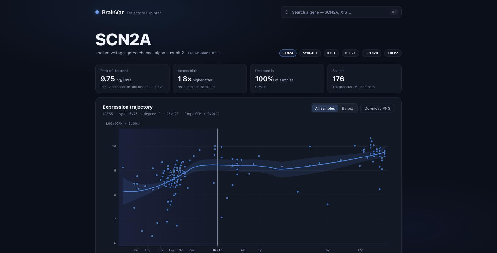
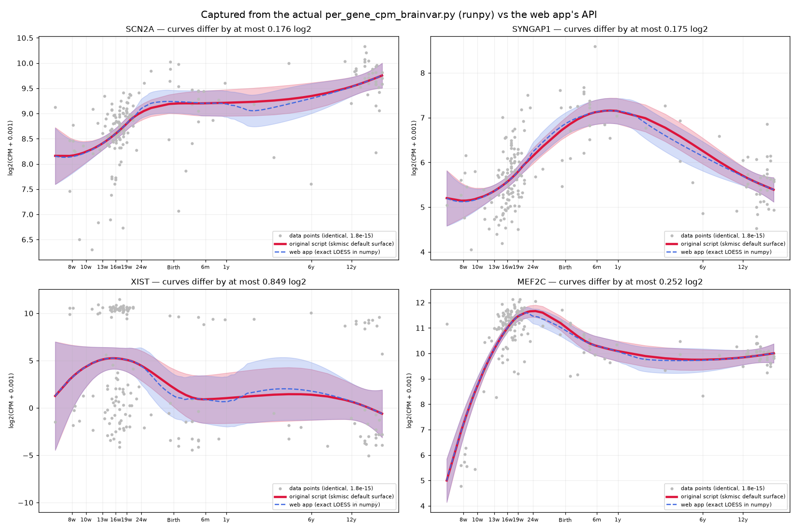

# BrainVar Trajectory Explorer

[](https://github.com/Haseeb-Akhlaq/brainvar-explorer/actions/workflows/ci.yml)

A web app for exploring how genes behave as the human brain grows. Type the
name of a gene and it draws a chart of how active that gene is at each stage of
life, from a few weeks after conception through to adulthood. The chart is
built from measurements of 176 brain tissue samples, with a smooth line showing
the overall trend.



It began as a replacement for a legacy analysis script,
`per_gene_cpm_brainvar.py`, which took **12 seconds** per gene, re-parsing a
98 MB matrix on every run, and wrote a PDF to a hardcoded path. The API answers
in **~26 ms**.

---

## Stack

| | |
|---|---|
| **Backend** |     |
| **Database** |  |
| **Frontend** |    |
| **Infrastructure** |     |

---

## Run it locally

Needs Docker, and the three BrainVar data files, which are not in the repo.

```bash
# 1. Clone
git clone https://github.com/Haseeb-Akhlaq/brainvar-explorer.git
cd brainvar-explorer

# 2. Configure, and put the data files in place
cp backend/.env.example backend/.env
mkdir -p data && cp -r /path/to/brainvar-files data/brainvar

# 3. Start the stack
docker compose -f docker-compose.local.yml up -d --build --wait

# 4. Load the dataset and create a user to sign in with
docker compose -f docker-compose.local.yml exec backend python manage.py load_brainvar
docker compose -f docker-compose.local.yml exec backend python manage.py createsuperuser
```

| | |
|---|---|
| app | http://localhost:5173 |
| API | http://localhost:8001/api/genes/SCN2A/ |
| admin | http://localhost:8001/admin/ |
| interactive API reference | http://localhost:8001/api/docs/ |

Tests:

```bash
docker compose -f docker-compose.local.yml exec backend python manage.py test
docker compose -f docker-compose.local.yml exec frontend npm test
```

Deployment to EC2 is documented in [DEPLOYMENT.md](DEPLOYMENT.md).

---

## How it works

```
        ┌─────────────┐   GET /api/genes/SCN2A/   ┌──────────────┐
        │  React SPA  │ ────────────────────────► │  Django REST │
        │   (Vite)    │ ◄──────────────────────── │   Framework  │
        └─────────────┘   points + fitted curve   └──────┬───────┘
                                                          │
                                              ┌───────────┴──────────┐
                                              │      PostgreSQL      │
                                              │  60,155 genes        │
                                              │  176 samples         │
                                              │  121,953 aliases     │
                                              └──────────────────────┘
```

A request costs **two indexed lookups and a 9 ms curve fit**:

```
"SCN2A" ──► GeneAlias ──► Gene.values (176 floats)
                              │
            Sample.column_index gives each value its donor and age
                              │
                          LOESS fit ──► JSON ──► chart
```

### Decisions worth explaining

**One row per gene, not one row per measurement.** The obvious relational
design — `Expression(gene, sample, cpm)` — is 10.6 million rows to store a
matrix that never changes, and turns every plot into a 176-row gather. Instead
each gene holds its values in a Postgres array ordered by `Sample.column_index`,
which is `UNIQUE` in the schema. That constraint is the only thing standing
between a bad data load and silently mis-plotting every gene in the app.

**The LOESS fit is reimplemented in numpy.** `scikit-misc`, which the original
script uses, publishes no `linux/aarch64` wheels, so it cannot be installed in a
container on Apple Silicon without x86 emulation or a Fortran toolchain in the
image. `backend/brainvar/loess.py` implements the same local quadratic
regression with tricube weights and the exact smoother-matrix inference, and is
tested against fixtures generated by `skmisc` itself — agreeing to **1e-13**.

**Names resolve through an alias table built from both ID sources.** The CPM
matrix and the HGNC mapping were built against different Ensembl releases and
disagree on 295 named genes, where the original script raises an error even
though the data is present. Resolution prefers the matrix, because that is the
only source whose genes can actually be plotted.

**Django rather than FastAPI.** For a read-only endpoint FastAPI would be
leaner. Django was chosen for where this goes next: the admin gives curators an
interface at no cost, and `django.contrib.auth` is a battle-tested permissions
layer for a platform whose whole point is controlled access to research data.

---

## Verified against the original script

The original `per_gene_cpm_brainvar.py` is executed unmodified via `runpy`, with
its matplotlib calls intercepted to capture exactly what it plots. Those arrays
are compared against the API's response:



| gene | data points | fitted curve |
|---|---|---|
| SCN2A | **1.8e-15** | 0.176 |
| SYNGAP1 | **1.8e-15** | 0.175 |
| XIST | **1.8e-15** | 0.849 |
| MEF2C | **1.8e-15** | 0.252 |

*(max absolute difference, log2 CPM)*

The **data points are identical** — 1.8e-15 is floating-point epsilon.

The curves differ because `skmisc` defaults to an interpolating kd-tree surface,
which deviates from its own exact solution by up to 0.85 log2 on this data. This
implementation computes the exact solution and matches `skmisc`'s exact mode to
1e-13. Reproduce it with:

```bash
python verification/capture_script.py SCN2A SYNGAP1 XIST MEF2C
python verification/compare_against_script.py
```

Seven further findings from porting the script — including three reasons it
cannot run on a clean machine — are in [FINDINGS.md](FINDINGS.md).

---

## Layout

```
backend/
  config/           settings, root urls, health check
  brainvar/         Gene, Sample, GeneAlias; services; loess.py; API
    management/     load_brainvar — the one-off data load
    tests/          99 tests, including skmisc reference fixtures
  users/            custom user model, email authentication
frontend/
  src/lib/          API client, LOESS port, trajectory assembly
  src/components/   chart, search, stat tiles, sample table
nginx/              reverse proxy, TLS, security headers
verification/       runs the original script and diffs it against the API
```

## Testing

137 tests in total.

| | |
|---|---|
| backend | 119 — models, services, API contract, the loader, LOESS |
| frontend | 18 — the browser LOESS against the same `skmisc` fixtures |

Two are worth pointing at. `test_api.py` asserts `assertNumQueries(2)` on the
gene endpoint, so the performance claim is a regression guard rather than a
comment. `test_loader.py` builds its own small matrix with the metadata rows
deliberately out of order, so the column alignment is exercised rather than
assumed.

The suite was also mutation-tested: three defects were introduced deliberately
to check the tests noticed. Two were caught; the third exposed a real gap in the
fixtures, which is documented in [FINDINGS.md](FINDINGS.md#8-the-test-suite-and-proof-that-it-can-fail).
