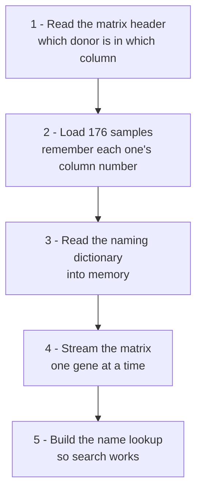

The dataset arrives as three text files. One command reads them and fills the
database:

```bash
python manage.py load_brainvar
```

It takes about 17 seconds. This page explains what it does and, at the end,
exactly where every row in the database came from.

## The three files

| file | size | what it holds |
|---|---|---|
| `brainvar_meta_data.txt` | 7 KB | one line per brain donor — age, sex, developmental period |
| `brainVar.CPM-10042019.tsv` | 94 MB | the expression matrix: one line per gene, one column per donor |
| `gene_to_gene_human.txt` | 5 MB | a naming dictionary — official gene symbols and their Ensembl ids |

The big one is the matrix. Think of it as a spreadsheet 60,155 rows tall and
176 columns wide: **every gene measured in every donor**, about 10.6 million
numbers.

```
                  HSB100   HSB105   HSB107   ...   (176 donors)
ENSG00000000003|TSPAN6    45.2     51.8     48.0
ENSG00000000005|TNMD       0.0      0.1      0.0
ENSG00000136531|SCN2A    512.4    498.1    530.7
...  (60,155 genes)
```

## The five steps



### 1. Read the matrix header

The first line of the matrix lists the donors in the order their columns
appear. There is one oddity worth knowing: that line has **176 names but each
data row has 177 fields**. The extra field is the gene id, and the header
simply has no label for it — a common convention meaning "the first column is
the row's name, not data".

So the loader reads the header and builds a small map:

```
HSB100 → column 0
HSB105 → column 1
HSB107 → column 2
...
```

### 2. Load the donors

Each line of the metadata file becomes one `Sample` row — age in days, sex,
developmental period. Crucially, each sample also stores **which column of the
matrix it occupies**, taken from step 1.

That column number is the join between the two files. Nothing else connects
them.

### 3. Read the naming dictionary

`gene_to_gene_human.txt` is loaded into memory (it is only 5 MB) as a lookup
from Ensembl id to the official name — so `ENSG00000136531` can be reported as
"sodium voltage-gated channel alpha subunit 2".

### 4. Stream the matrix

The matrix is 94 MB, which is too big to read into memory comfortably, so it
is read **one line at a time** and written to the database in batches of 1,000
genes.

For each line the loader:

1. splits the id — `ENSG00000136531|SCN2A` becomes an Ensembl id and a symbol;
2. reads the 176 numbers **in file order**, keeping them as a plain list;
3. computes `log2(value + 0.001)` for each, which is what the chart plots;
4. records whether the gene is expressed at all — 12,680 of them are zero in
   every single donor, and marking them lets search push them down.

The 176 values are stored as **one array on the gene row**, not as 176
separate rows. That is the single decision this design turns on: a normalised
table would hold 10.6 million rows and need a join to draw one chart, whereas
this holds 60,155 rows and needs none.

The array is positional — the value at index 3 belongs to whichever sample has
`column_index = 3`. That is why step 2 records the column number, and why
`column_index` is a unique column in the database. **If the two ever disagreed,
every chart would silently plot the right numbers against the wrong ages.**

### 5. Build the name lookup

People search for `SCN2A`, not `ENSG00000136531`, so the last step builds a
table of every name that should find a gene. Three kinds of name are
registered, in priority order:

1. the **Ensembl id** — `ENSG00000136531`
2. the **matrix's own symbol** — `SCN2A`
3. the **official HGNC symbol**, but only when it adds something new

Names are stored uppercase, so searching is case-insensitive.

Order matters because a name can only point at one gene. The matrix wins ties,
because it is the only source whose genes actually have data to plot — the two
files were built against different Ensembl releases and disagree about 295
genes.

## Where the record counts come from

This is the part worth being able to answer directly.

### 176 samples

`brainvar_meta_data.txt` has a header line plus 176 donor lines. Every one
becomes a row.

> A detail that catches people out: the file has no trailing newline, so
> `wc -l` reports 176 rather than 177. All 176 donors are loaded — none are
> dropped.

### 60,155 genes

The matrix has 60,156 lines: one header plus 60,155 gene rows. Every gene row
becomes exactly one `Gene`. Nothing is filtered out, including the 12,680
genes that are zero everywhere — they are kept and flagged rather than
discarded, so searching for one gives "measured, but not expressed" instead of
"not found", which is a different and more useful answer.

### 121,953 aliases

This is the number that looks surprising, and it is just three additions:

| source | rows | where they come from |
|---|---|---|
| Ensembl ids | 60,155 | one per gene, always unique |
| matrix symbols | 57,996 | the `SCN2A` half of each id |
| HGNC symbols | 3,802 | official names the matrix did not already supply |
| **total** | **121,953** | |

The middle row is the interesting one. There are 60,155 genes but only
**57,996 distinct symbols** — 2,159 genes share a symbol with another gene.
A name has to point at exactly one gene, so the first gene to claim a symbol
keeps it and the later duplicates are reachable by their Ensembl id instead.

The last row is small because most genes in the dictionary already carry the
same symbol the matrix uses; only 3,802 add a name that was not already
registered.

## Checking it worked

The loader prints a count after each step. Two quick checks confirm the join
is right rather than merely plausible:

```bash
python manage.py load_brainvar
# Step 2: 176 samples loaded.
# Step 4: 60,155 genes loaded.
# Step 5: 121,953 aliases created.
```

Then search for **XIST**, a gene on the X chromosome that is switched on in
females and off in males. Split the chart by sex and the two groups separate
completely — a median of about 1,350 CPM against 0.37.

Nothing in the loader knows about sex. If the sample-to-column mapping were
off by even one position, that separation would blur or vanish. It is the
cheapest possible proof that the right numbers are attached to the right
people.
