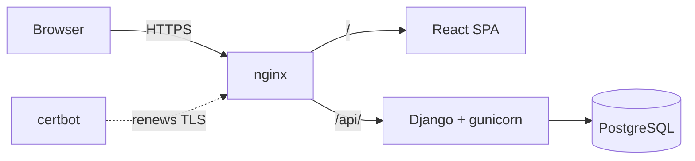
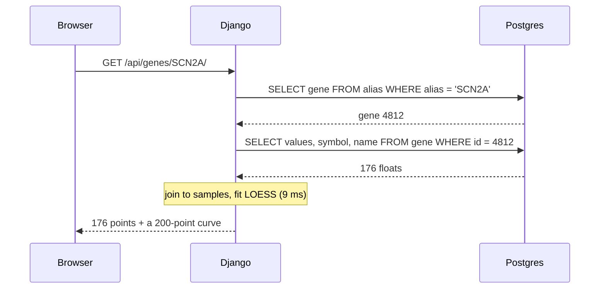

Four containers, one network. Only nginx is exposed.



## What happens on a lookup

Typing `SCN2A` and pressing enter costs **two indexed queries and one curve
fit**:



`test_api.py` asserts `assertNumQueries(2)` on that endpoint, so an accidental
N+1 fails the build rather than quietly slowing the application down.

## Why the data is shaped this way

### One row per gene, not one per measurement

The textbook relational design is `Expression(gene, sample, cpm)` — one row per
cell. For this matrix that is **10.6 million rows** to store something that
never changes, and every plot becomes a 176-row gather with a sort.

Instead each gene holds its values in a PostgreSQL array:

```
brainvar_gene
  ensembl_id    ENSG00000136531
  symbol        SCN2A
  values        {522.887, 300.106, 570.651, …}   ← 176 elements
  mean_log2     8.894744
  is_expressed  true
```

Normalisation exists to prevent update anomalies. There are no updates here —
the dataset is republished as a whole, and reloading takes 17 seconds.

### `column_index` is the contract

The array is **positional**. Element *i* belongs to the sample whose
`column_index` is *i*, and that column is `UNIQUE` in the schema.

That constraint is the only thing standing between a bad load and silently
mis-plotting every gene in the application. It is enforced by the database, not
by convention, and `test_loader.py` exercises it with metadata rows deliberately
ordered differently from the matrix columns.

### An alias table, not a mapping file

The CPM matrix labels each row `ENSG00000136531|SCN2A`, carrying both
identifiers. The original script discarded the symbol and re-derived names from
`gene_to_gene_human.txt`.

The two files were built against different Ensembl releases and **disagree on
295 named genes**. For those, the mapping returns an id the matrix does not
contain, and the script raises an error even though the data is present:

```
$ python per_gene_cpm_brainvar.py ADORA3
ValueError: Ensembl ID ENSG00000282608 not found in CPM file
```

Every known name is registered in `brainvar_gene_alias` instead, built from both
sources, with **the matrix winning any conflict** — because it is the only
source whose genes can actually be plotted.

## Why Django

For a single read-only endpoint, FastAPI would be leaner. Django was chosen for
where the application goes next rather than where it is today:

- **The admin comes free.** Curators get a working interface over genes and
  samples with no extra code.
- **`django.contrib.auth` is a real permissions layer.** For a platform whose
  purpose is controlled access to research data, hand-rolling that is the wrong
  kind of ambition.
- **Migrations make the schema reproducible**, which matters for research
  software that has to be rebuilt years later.

The tradeoff is real and worth naming: most of Django is unused here.
