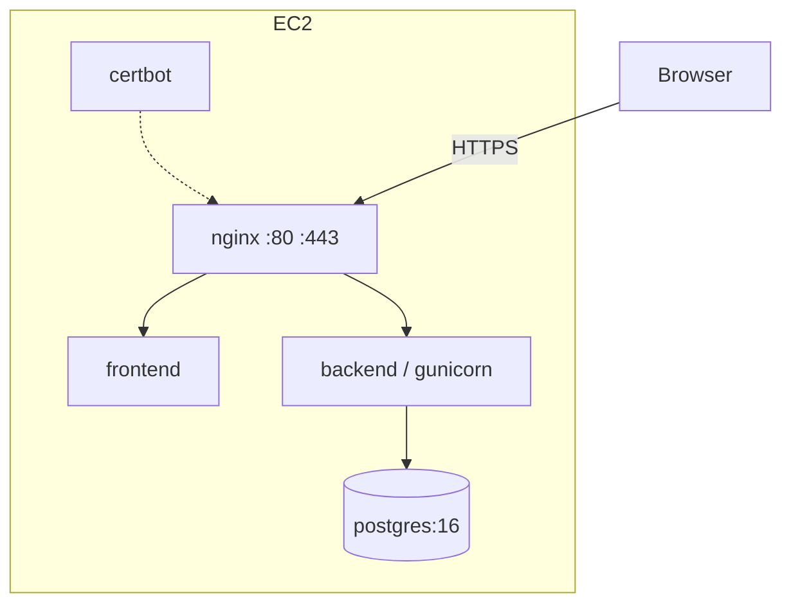

Running at **[brainvar.haseebakhlaq.com](https://brainvar.haseebakhlaq.com)** on a
single EC2 instance in eu-west-2.



| host | serves |
|---|---|
| `brainvar.haseebakhlaq.com` | the React build |
| `api.brainvar.haseebakhlaq.com` | Django and the admin |

Only nginx binds host ports. PostgreSQL and Django are reachable only on the
internal Docker network — the database is never exposed.

## Deploying

```bash
git clone <repo> && cd brainvar-explorer
cp .env.prod.example .env.prod        # fill in the two secrets
./init-letsencrypt.sh                 # one SAN certificate for both hosts
docker compose -f docker-compose.prod.yml --env-file .env.prod up -d --build
```

Migrations and `collectstatic` run in the backend entrypoint, which waits for
Postgres to accept connections first.

Rehearse the certificate against Let's Encrypt's staging endpoint before the
real thing — failed attempts are rate-limited to five per hour per domain:

```bash
STAGING=1 ./init-letsencrypt.sh
```

## Split origins

The application and the API are different origins, which has consequences:

- the API sends **CORS** headers naming the app origin
- session cookies are **cross-site**, so they need `SameSite=None; Secure`
- both cookies are scoped to `.brainvar.haseebakhlaq.com` so one session covers
  both hosts

A same-origin deployment — the API under `/api/` on one hostname — would avoid
all of that. Split hosts were chosen so the API reads as a first-class,
shareable interface.

## Certificate renewal

One SAN certificate covers both hostnames. The certbot container attempts
renewal twice a day and nginx reloads every six hours, so a renewed certificate
is picked up without intervention.

## Backups

```bash
docker compose -f docker-compose.prod.yml --env-file .env.prod \
  exec -T db pg_dump -U brainvar brainvar_explorer | gzip > backup-$(date +%F).sql.gz
```

The database is fully derivable from the three source files by re-running the
loader, so this is convenience rather than a hard requirement.
